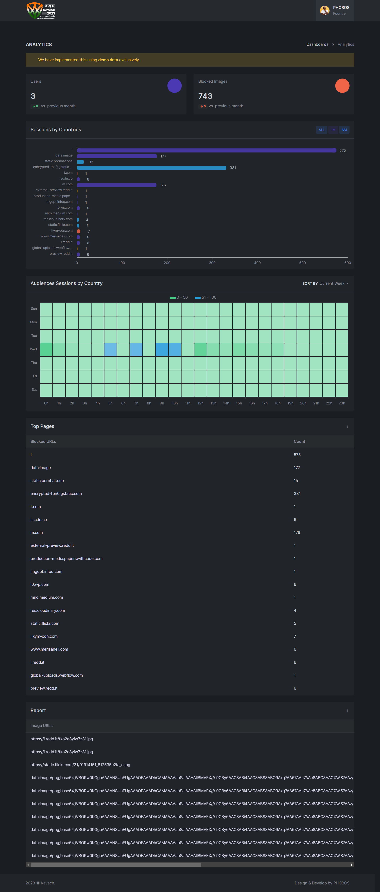

**Admin Panel - Readme**

Welcome to the "admin-panel" subfolder. This PHP program provides a comprehensive dashboard for analyzing data related to the usage of the Chrome extension designed to block NSFW (Not Safe For Work) images. This dashboard allows you to monitor real-time statistics, visualize trends, and gain insights into user behavior.

**Features:**

1. **User Statistics:**
   - Track the number of users actively using the Chrome extension in real-time.

2. **NSFW Images Blocked:**
   - Monitor the total count of NSFW images that have been successfully blocked by the extension.

3. **Domain Analysis:**
   - Visualize a graph that highlights domains with the highest number of blocked NSFW images.

4. **Timeline Chart:**
   - Analyze a timeline chart showing the distribution of NSFW content viewership throughout the day.

5. **Unsafe Domains List:**
   - Access a list of domains that have been flagged as containing the most unsafe content.

6. **Live Blocked Image URLs:**
   - View live URLs of the NSFW images that are being blocked in real-time.

7. **Link Tracker and Model Retraining:**
   - Import the "link_tracker.sql" file into your database to enable the tracking of NSFW image URLs reported by users via the Chrome extension.
   - After installing the Chrome extension, users can right-click and select "Get Image Link" with the Kavach logo. Clicking on this option redirects to a reporting form for the image URL. This URL will be added to the database to enhance model retraining accuracy.

8. **True/False Prediction Reporting:**
   - The dashboard provides facilities for reporting predictions made by the extension. Users can report instances where the extension made a false positive (predicting NSFW incorrectly) or a false negative (missing NSFW content) prediction.

**Getting Started:**

1. **Setup:**
   - Install a compatible web server with PHP support to host the admin panel.
   - Place the PHP files from this subfolder in your web server's directory.

2. **Database Configuration:**
   - Set up a database to store user and extension data (e.g., MySQL).
   - Import the "link_tracker.sql" file into your database to enable image URL tracking.

3. **Real-time Monitoring:**
   - The dashboard provides live updates on user counts, blocked images, and more.

4. **Visualize Data:**
   - Use the graphs and charts to visualize trends and insights related to NSFW content blocking.

**Usage Guidelines:**

- This admin panel is intended for internal use to monitor and analyze data related to the Chrome extension's performance.
- Ensure the privacy and security of user data by implementing proper security measures.
- Respect user privacy and adhere to legal regulations regarding data collection and monitoring.

**Disclaimer:**

- This admin panel provides insights into the usage of the Chrome extension for NSFW content blocking.
- Ensure responsible use and ethical considerations when dealing with sensitive data.
- Respect privacy laws and user consent for data collection and analysis.

*Utilize the admin panel to gain valuable insights and optimize the performance of the NSFW content blocking extension.*